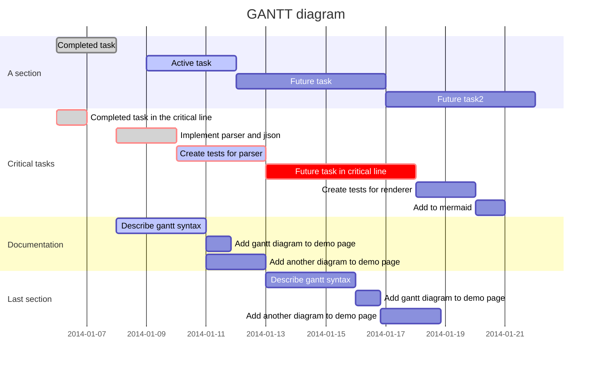

[](https://gitlab.echosystem.fr/Erreur32/MOTDs32/commits/master)

### MOTDs32 installation instructions
 

 (2017) New project MOTDs32 by Erreur32

   https://gitlab.echosystem.fr/Erreur32/MOTDs32

    ,--.   ,--. ,-----. ,--------.,------.         ,----.  ,---.
    |   `.'   |'  .-.  ''--.  .--'|  .-.  \  ,---. '.-.  |'.-.  \
    |  |'.'|  ||  | |  |   |  |   |  |  \  :(  .-'   .' <  .-' .'
    |  |   |  |'  '-'  '   |  |   |  '--'  /.-'  `)/'-'  |/   '-.
    `--'   `--' `-----'    `--'   `-------' `----' `----' '-----'

	          |  +	Ｓｔａｔｓ３２   |


## MOTDs32 Documentation:
 

Original project:
http://www.gelogic.net/ 

   MOTDs32 is a fork of the excelent MOTDstat !
  
  Usage: generate dynamicaly the /etc/motd file with current information about system resources and usage
  
 Using crontab the script will periodically display status of system resources and services. 
 
 The original message of the day is now stored in /etc/motd.orig file.

 Everytime you connect throught the SSH you will see some informations (customisable).
 
 See the example
 
---

[toc] 

 
## INSTALLATION: 
 
 (git clone https://gitlab.echosystem.fr/Erreur32/MOTDs32.git)
 
 type inside the directory: 
       
       ./Install.sh
 
 ## UPDATE:
 ======

    cd /PATH/MOTDs32
    git pull


## Customisation:
 
When you want MOTD to be displayed while logging via SSH client you will
have to change setting on the SSH daemon as following: /etc/ssh/sshd_config

	~snip~
	PrintMotd yes
	~snip~

To apply the changes, restart the SSH server daemon.


## Sample  MOTD32 report


```
00:03:47 19/07 root@echosystem .../Stats-tools/MOTDs32 (master)# /usr/bin/motds32 -c

motds32 check motd file
        echosystem.fr  > status at 00:03 > 5min load is 0.75 on 8 cpu(s)

      Disk status        |      Memory status       |     Service status
partition      free  usg | Memory      used kB  [%] | service(s)        (count)
/              5,9G  68% | Memory:    61431116  92% | tcp/0.0.0.0:2222
/home          1,5T  12% | Swap:          3500   0% | tcp6/:::2222
                         | Buffers:    1266580      | tcp/0.0.0.0:25
                         | Cached:    50682196      | tcp6/:::25
                         |                          | tcp/127.0.0.1:8080
                         |                          | tcp6/:::80
                         |                          | tcp6/:::443
                         |                          | udp/37.187.162.229:123
                         |                          | udp/127.0.0.1:123
                         |                          | udp/0.0.0.0:123
                         |                          | udp6/fe80::ec4:7aff:fe0f:123
                         |                          | udp6/2001:41d0:d:2e5:::123
                         |                          | udp6/::1:123

          _                         _                    __
  ___  ___| |__   ___  ___ _   _ ___| |_ ___ _ __ ___    / _|_ __
 / _ \/ __| '_ \ / _ \/ __| | | / __| __/ _ \ '_ ` _ \  | |_| '__|
|  __/ (__| | | | (_) \__ \ |_| \__ \ ||  __/ | | | | |_|  _| |
 \___|\___|_| |_|\___/|___/\__, |___/\__\___|_| |_| |_(_)_| |_|
                           |___/
/bin/bash ==> root

 00:05:44 up 64 days,  5:35,  3 users,  load average: 1,18, 0,84, 0,70
USER     TTY      FROM             LOGIN@   IDLE   JCPU   PCPU WHAT
erreur32 pts/0    213.173.170.22   15:43    6:51m  1.62s  0.03s sshd: erreur32 [priv]
erreur32 pts/1    2a01:e35:8aa3:87 18:35    1:06m  2.55s  0.02s sshd: erreur32 [priv]
erreur32 pts/2    2a01:e35:8aa3:87 18:44    2.00s  3.29s  0.02s sshd: erreur32 [priv]

Debian GNU/Linux 8.8 (jessie) (3.16.0-4-amd64).
Kernel Info:    Linux 3.16.0-4-amd64 x86_64

-----------     ---     ------------    ----------
System load :   1.18    IP Address:     37.187.162.229
Memory usage:   14.4%   System uptime:  64 days
Usage on /  :   68%     Swap usage:     0.0%
Local Users :   3       Processes:      286
-----------     ---     ------------    ----------

  mercredi 19 juillet 2017, 00:05:44 (UTC+0200)
```


```
Explanation of the report
-------------------------

   system hostname              report time        system load
         |                          |                   |
         |      NTP status          |                   |  Number of CPU(s)
         |         |                |                   |      |
         V         V                V                   V      V                  
hosting.gelogic.net*+ > status at 19:15 > 5min load is 1.06 on 4 cpu(s)
```

 
## working progress diagram



 

## Author

::: success
 by 🅴🆁🆁🅴🆄🆁32
:::

 

::: warning
  Hosted on
:::


::: info
🅴🅲🅷🔵🆂🆈🆂🆃🅴🅼
:::
 